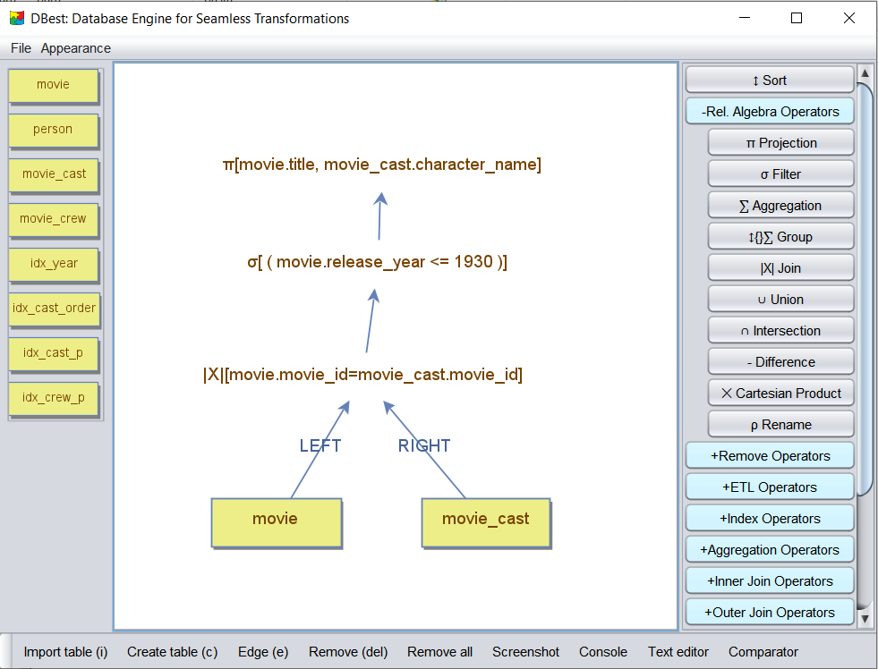

    <a href="./04 - working-with-temp-tables.md">Previous</a>

  <a href="./06 - using-basic-operators.md">Next</a>

# Creating a Query Tree in DBest

In DBest, a **query tree** is composed of two types of nodes:  
- **Data Nodes**: Represent data sources and are located in the **left panel**.  
- **Operator Nodes**: Represent transformations or operations and are located in the **right panel**.

A query tree is built by adding nodes to the editor, connecting them, and configuring their properties.

The image below illustrates the tool. The left panel contains the data nodes, while the right panel lists the available operators.  

---

## Adding Nodes to the Editor

1. **Adding Operator Nodes**:
   - Click on the desired operator in the **right panel**.
   - Move your mouse to the editor and click to place the operator.

2. **Adding Data Nodes**:
   - Drag and drop a data node from the **left panel** into the editor.

---

## Connecting Nodes

1. Click the **"Edge"** button in the **bottom menu**.  
2. Select the **source node** by clicking on it.  
3. Click on the **target node** to complete the connection.

---

## Editing Node Properties

After connecting nodes, a **property window** will open for the operator. You can also open this window by **right-clicking** the operator node and selecting **"Edit"**.

For **binary operators**, the property window only becomes available after both child nodes are connected. Properties can only be edited if the node is valid and supports configuration.

---

### Operator Properties

The required properties vary depending on the operator type. Examples include:  
- **Projection Operator**: Allows selection of columns to project, based on the schema of its child node.  
- **Join Operator**: Requires a join predicate and shows columns from the left and right child nodes.  
- **Filter Operator**: Prompts you to define a boolean expression that must be satisfied, based on columns from its child node.

 

    <a href="./04 - working-with-temp-tables.md">Previous</a>

  <a href="./06 - using-basic-operators.md">Next</a>

