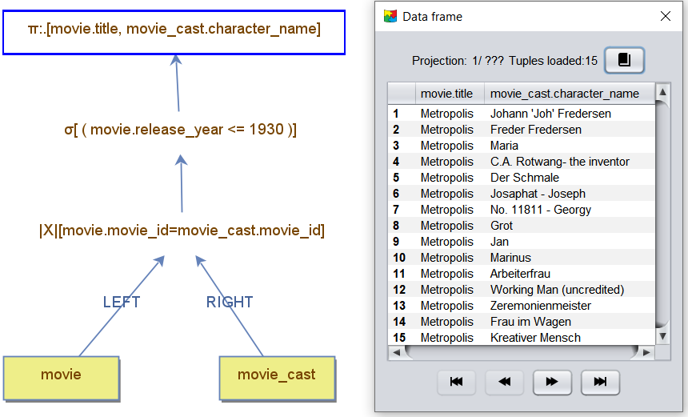

    <a href="./04 - using-basic-operators.md">Previous</a>

  <a href="./06 - other-query-options.md">Next</a>

# Running Queries

Once a query is built, you can execute it in the following ways:  
1. **Double-click** any node in the query tree.  
2. **Right-click** a selected node and choose the **"Run Query"** option from the menu.

 

## Querying Any Node
- **Internal Node**: Running a query on an internal node returns the intermediate result set generated up to that point in the query tree.  
- **Root Node**: To obtain the final result set, execute the query on the root node.

 

## Example: Root Node Execution
In the example below, the result set is generated by double-clicking the root projection node.  

 

## Navigating the Result Set
- Use the **arrow buttons** to navigate through the result set:
  - **Forward**: Computes and retrieves new tuples.  
  - **Backward**: Retrieves previously stored tuples from an earlier forward navigation.

 

    <a href="./04 - using-basic-operators.md">Previous</a>

  <a href="./06 - other-query-options.md">Next</a>

