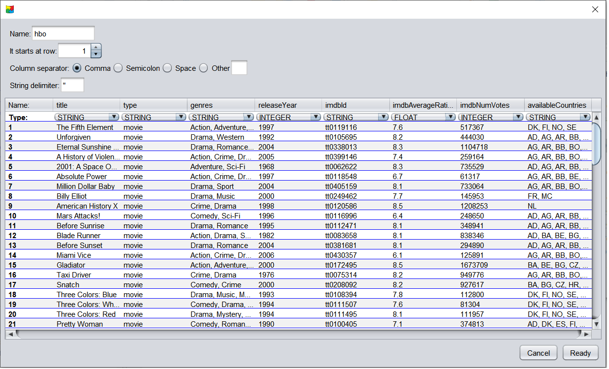

    <a href="./02 - operators.md">Previous</a>

  <a href="./04 - working-with-temp-tables.md">Next</a>

# Working with CSV Files in DBest

DBest provides support for working with CSV files. Follow these steps to import and manage CSV files in the tool:

## Opening a CSV File
- Use the **"Open CSV"** option in the menu and select the desired CSV file.
- Alternatively, drag and drop a CSV file directly into the **tree editor panel**.

When a file is selected, a wizard will appear, prompting you to specify parsing properties, such as:
- **Delimiter** (e.g., `,`, `;`, or `\t`)
- **Starting Line** (indicating where the data begins)

Once the properties are set, the tool will display the CSV in a tabular format. Each column will be assigned a type, which you can adjust to a more generic type if necessary.

## Viewing the CSV
The table view provides a clear representation of the CSV data, along with the inferred column types. A snapshot of the tool in action is shown below:

## Creating a Header File
Upon completing the importation process, DBest generates a **header file** in the same directory as the CSV file. The header file:
- Is named after the CSV file, with a `.head` extension (e.g., `data.csv` creates `data.head`).
- Stores metadata such as the delimiter and column types used during import.

This header file allows for faster re-importation of the CSV file. You can reopen it using the **"Open DBest header file "** menu option or by dragging and dropping it into the tree editor panel.

## Using the CSV Node in the Tree Editor
Once imported, the CSV node will appear in the **left-side panel**. To work with it:
1. Drag the CSV node to the **editor panel**.
2. Open the node using one of these methods:
   - **Double-click** the node.
   - **Right-click** the node and select **"Run Query"**.

Both methods allow you to navigate through the records efficiently.

 

    <a href="./02 - operators.md">Previous</a>

  <a href="./04 - working-with-temp-tables.md">Next</a>

