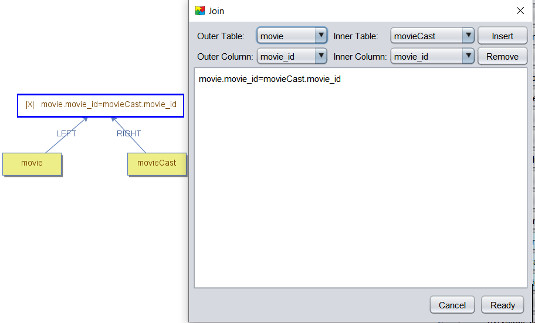
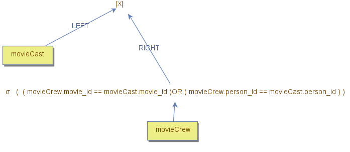

    <a href="./11 - creating-indexes.md">Previous</a>

  <a href="./13 - join-types.md">Next</a>

# Joins in Relational Table Queries

A **join** is one of the most important operations in relational table queries, connecting tables through **primary key/foreign key relationships**. There are two basic types of joins: **Equi-joins** and **Non-equi-joins**.

---

## **Equi-joins**

An **equi-join** contains a join predicate where the terms are **conjunctive equality conditions**. This is the most common type of join, used to match a **foreign key** with its respective **primary key value**. 

In DBest, join operators support **equi-joins only**. When the join configuration pop-up is opened, the user must specify which **left-side columns** need to match the **right-side columns**.

### **Example: Equi-join**

The image below demonstrates an equi-join between the `movie` and `movie_cast` data nodes using the **Nested Loop Join** algorithm. In this example, the configuration window defines a single term, comparing the `movie_id` column from both sides. More terms could be added if necessary.

### **Join Algorithms for Equi-joins**
When performing equi-joins, several algorithms (in their pure form or their variations) can be used, including:
- **Nested Loop Join** (used in the example above).
- **Hash Join**.
- **Merge Join**.

---

## **Non-equi Joins**

A **non-equi join** contains a join predicate where the terms include **filters other than conjunctive equality conditions**. The join condition can involve **any logical expression**.

### **Using Non-equi Joins in DBest**
In DBest, a non-equi join can be implemented using:
1. The **Nested Loop Join** algorithm.
2. An **empty join predicate**.
3. A **filter operator** on the inner side of the join to express the join predicate.

### **Example: Non-equi Join**

The query below demonstrates finding matches between the `movie_cast` and `movie_crew` tuples if they share the same `movie_id` or `person_id`. The **filter operator** contains the join terms:  
`movie_cast.movie_id = movie_crew.movie_id OR movie_cast.person_id = movie_crew.person_id`.

### **Referenced Columns in Non-equi Joins**
- Some columns in the filter refer to **outer side** columns of the join (e.g., `movie_cast.movie_id` and `movie_cast.person_id`). These are called **referenced columns**.
- Referenced columns are accessible only when the filter operator is connected to the join operator.
- Initially, the filter must contain a placeholder term (e.g., `1=1`) to allow its creation in the tool.
- Once connected to the join, the filter can be edited, replacing the placeholder with the proper join terms that reference the outer-side columns.

 

    <a href="./11 - creating-indexes.md">Previous</a>

  <a href="./13 - join-types.md">Next</a>

