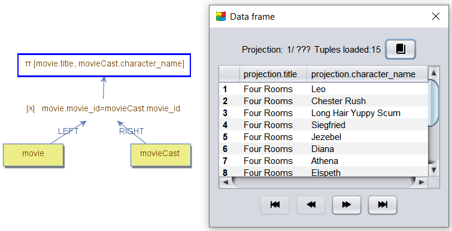
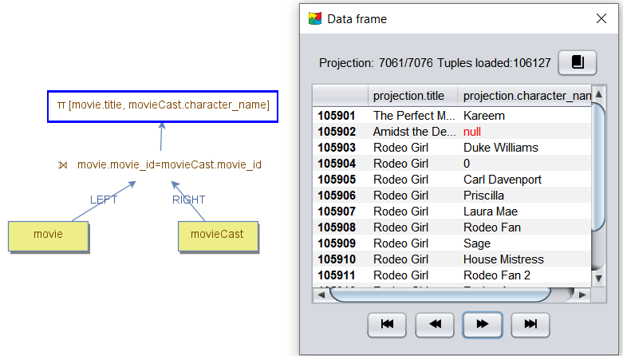
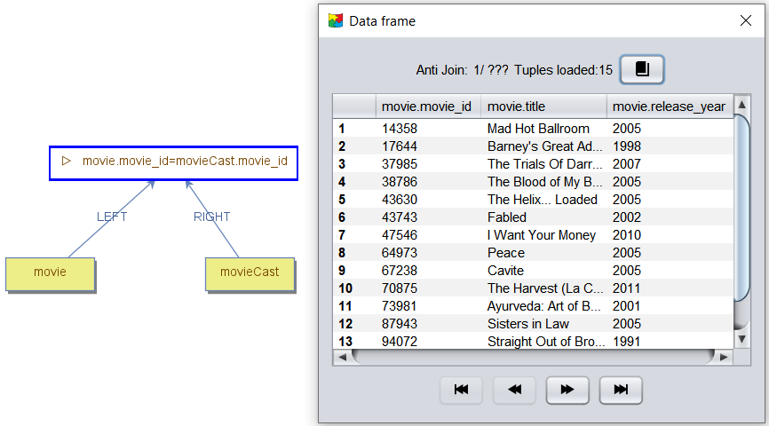

    <a href="./12 - equi-joins.md">Previous</a>

  <a href="./14 - join-algorithms.md">Next</a>

# Join Types

There are several types of joins, each serving different purposes: **Inner Join**, **Outer Join**, **Semi Join**, and **Anti Join**.

---

## 1. **Inner Join**
The **Inner Join** is the most commonly used join type. For each tuple on the outer side, it finds matching tuples on the inner side. The result is a tuple formed by concatenating the outer-side tuple with the matching inner-side tuple.

The inner join can be implemented using three different algorithms:
- **Nested Loop Join**
- **Merge Join**
- **Hash Join**

### Example:
The example below shows the **Nested Loop Inner Join** between `movie` and `movie_cast`. A projection is used to reduce the number of returned columns to just `title` from `movie` and `character_name` from `movie_cast`. Without this projection, all columns from both data nodes would be returned.

---

## 2. **Outer Join**
The **Outer Join** operates similarly to the Inner Join but includes unmatched tuples:
- **Left Outer Join:** Retrieves all tuples from the outer side. If no match is found on the inner side, the tuple is complemented with `NULL` values for the inner side.
- **Right Outer Join:** Retrieves all tuples from the inner side. If no match is found on the outer side, the tuple is complemented with `NULL` values for the outer side.
- **Full Outer Join:** Retrieves all tuples from both sides. Tuples with no matches on either side are complemented with `NULL` values.

### Implementation of Outer Joins:
- **Left Outer Join:** Can be implemented using **Nested Loop Join**, **Merge Join**, or **Hash Join**.
- **Right Outer Join:** Can be implemented using **Merge Join** or **Hash Join**.
- **Full Outer Join:** Can be implemented using **Merge Join** or **Hash Join**.

### Example:
The example below shows the **Nested Loop Left Outer Join** between `movie` and `movie_cast`. Movies without corresponding `movie_casts` are complemented with `NULL` values for the `character_name` column.

---

## 3. **Semi Join**
The **Semi Join** retrieves a tuple from one side only if at least one match exists on the other side. It does not return tuples from the other side.

- **Optimized Behavior:** The algorithm only checks if a match exists, avoiding the overhead of locating and returning all matches.
- **Left Semi Join:** Returns tuples from the outer side.
- **Right Semi Join:** Returns tuples from the inner side.

### Implementation of Semi Joins:
- **Left Semi Join:** Can be implemented using **Nested Loop Join**, **Merge Join**, or **Hash Join**.
- **Right Semi Join:** Can be implemented using **Merge Join** or **Hash Join**.

### Example:
The example below shows the **Nested Loop Left Semi Join** between `movie` and `movie_cast`. Only movies with cast members are returned. Note that `movie_cast` columns are not available for retrieval after the join.

---

## 4. **Anti Join**
The **Anti Join** retrieves tuples from one side when no matches exist on the other side.

- **Optimized Behavior:** The algorithm only verifies the absence of matches, without retrieving any.
- **Left Anti Join:** Returns tuples from the outer side.
- **Right Anti Join:** Returns tuples from the inner side.

### Implementation of Anti Joins:
- **Left Anti Join:** Can be implemented using **Nested Loop Join**, **Merge Join**, or **Hash Join**.
- **Right Anti Join:** Can be implemented using **Merge Join** or **Hash Join**.

### Example:
The example below shows the **Nested Loop Anti Join** between `movie` and `movie_cast`. Only movies without cast members are returned. Note that `movie_cast` columns are not available for retrieval after the join.

 

    <a href="./12 - equi-joins.md">Previous</a>

  <a href="./14 - join-algorithms.md">Next</a>

