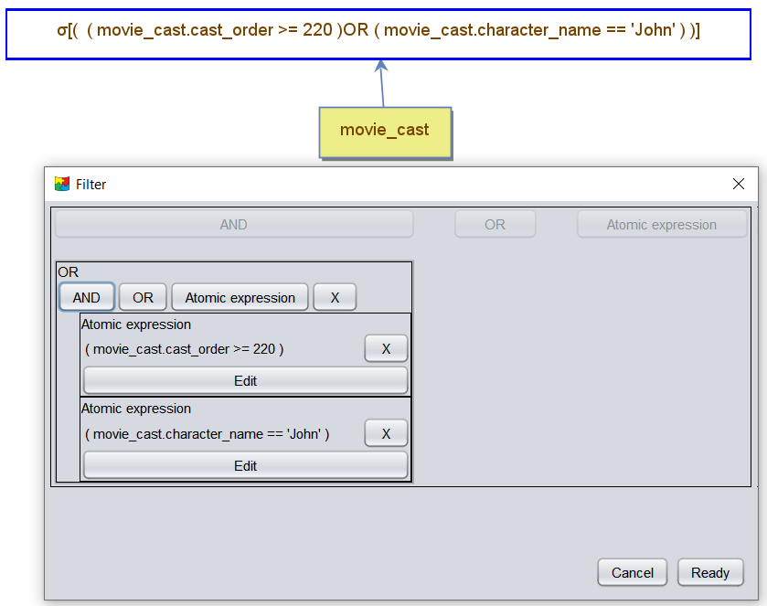
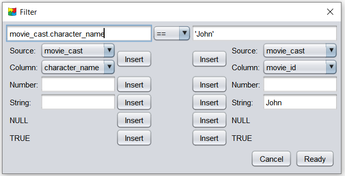
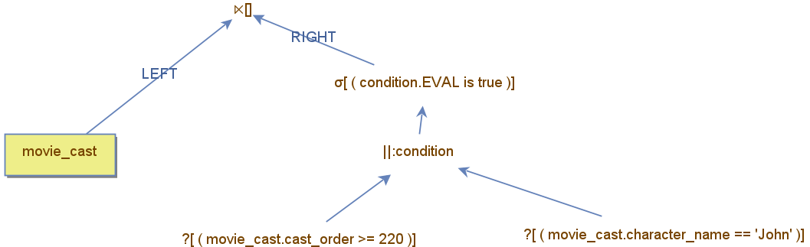
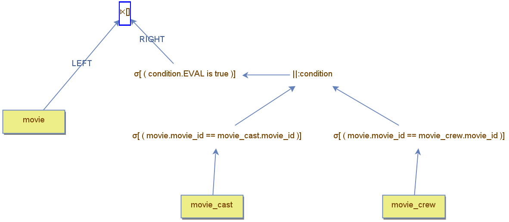

<div align="left">
    <a href="./14 - join-algorithms.md">Previous</a>
</div>
<div align="right">
  <a href="./16 - comparing-query-costs.md">Next</a>
</div>


## Boolean Expressions and the Filter Operator

A **boolean expression** is a structure composed of smaller expressions that evaluate to either `true` or `false`. 

### Combining Boolean Expressions
Boolean expressions can be combined using logical operators such as: **AND** and **OR**.

### Boolean Expressions in Filter Operators
One common use of boolean expressions is within the **Filter Operator**, which returns only the rows that satisfy the boolean expression.  The boolean expression is defined by editing the properties of the filter operator.

---

### Boolean Expression Editor
The Boolean Expression Editor allows users to create and modify expressions, including:
- **AND Expressions:** Combine multiple conditions, all of which must be `true`.
- **OR Expressions:** Combine multiple conditions, where at least one must be `true`.
- **Atomic Expressions:** Involve a single comparison between two elements, such as:
  - **Constant values** (e.g., `5`, `'John'`)
  - **Dynamic values** (e.g., values from columns)

---

### Example: Creating a Boolean Expression
The example below demonstrates how to create a boolean expression for a filter operator. The expression includes:
- An **OR expression** that combines two atomic expressions.

Additional atomic expressions or sub-expressions can be added by clicking the appropriate button in the editor.



---

### Example: Editing an Atomic Expression
The example also shows how to edit an existing atomic expression. The user changes the compared elements, such as modifying constant values or selecting different columns for comparison.



## Boolean Expressions and Specialized Boolean Operators

A **boolean expression** can also be created using specialized boolean operators such as **AND**, **OR**, **XOR**, and **Condition**. These operators evaluate to `true` or `false` based on their inputs.

---

### Specialized Boolean Operators

1. **AND, OR, and XOR Operators**  
   - These are **binary operators** that combine the boolean return values of their connected operators.  
   - Evaluation logic:  
     - **Boolean Operators:** If a connected operator is itself a boolean operator, its `true` or `false` value is used.  
     - **Non-Boolean Operators:** If a connected operator returns any tuples, it evaluates to `true`; if no tuples are returned, it evaluates to `false`.

2. **Condition Operator**  
   - This is a **nullary operator**, meaning it does not connect to any other operator.  
   - It performs a **direct comparison** between two elements, which can be:  
     - **Constant values** (e.g., `5`, `'John'`)  
     - **Column values** (must reference existing columns).  

---

### Example: Boolean Expression with Boolean Operators
The example below demonstrates how to create the same boolean expression as in the earlier example, but this time using boolean operators instead of editing the properties of a filter operator. Key points:
- **OR operator (||)**: Combines two condition operators.
- **Condition operators (?)**: Use referenced columns for comparisons.



The filter operator is still present, but now it contains a simpler expression that directly tests the result of the **AND operator**.

---

### Advantages of Using Boolean Operators
Using boolean operators provides a more **powerful and flexible representation** of boolean expressions:
- **Visual Construction:** Operators can be added by dragging and dropping, enabling intuitive manipulation of expressions.
- **Complex Expressions:** Any operator can be connected to the evaluation tree, allowing more advanced constructs.

---

### Example: Complex Query with Boolean Operators
The example below demonstrates how to solve the following SQL query using boolean operators:  

```sql
SELECT * 
FROM movie 
WHERE movie_id IN (SELECT movie_id FROM movie_cast) 
   OR movie_id IN (SELECT movie_id FROM movie_crew)
```




In this query tree:

- **OR operator**: Combines results from two subqueries.
- **Subqueries**: Represented by operators returning tuples from movie_cast and movie_crew.
- The **filter operator** evaluates the result of the OR operator.
  
This approach showcases the flexibility of boolean operators in constructing complex expressions.

<br>

<div align="left">
    <a href="./14 - join-algorithms.md">Previous</a>
</div>
<div align="right">
  <a href="./16 - comparing-query-costs.md">Next</a>
</div>


