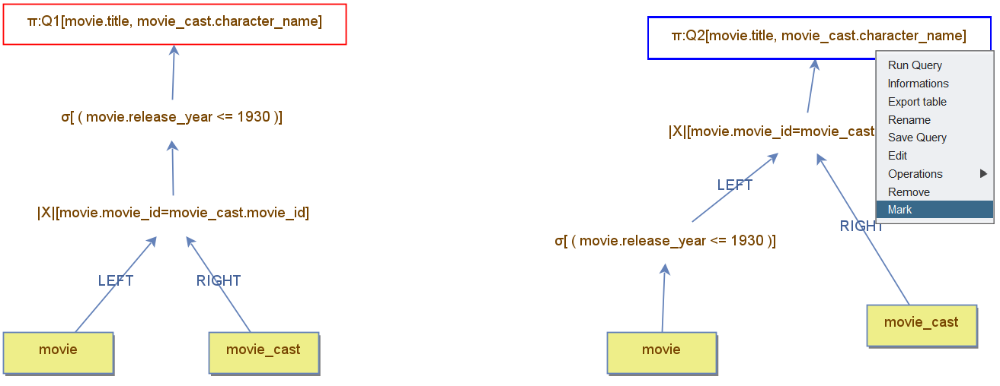
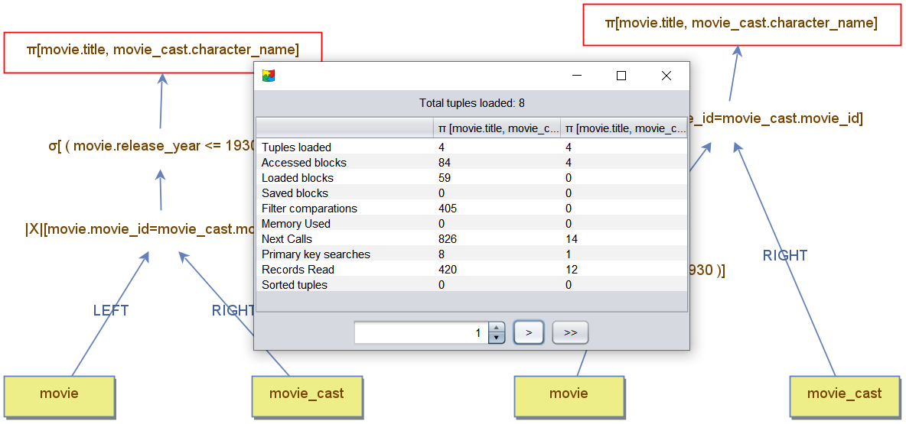

    <a href="./15 - using-boolean-expressions.md">Previous</a>

  <a href="./17 - examples.md">Next</a>

# Query Plan Comparison and Efficiency

When executing queries, multiple **query plans** may be logically equivalent, meaning they produce the same result set regardless of the stored data. However, these plans can differ in efficiency, influenced by execution time and memory usage. Efficiency depends on the amount of data processed and the logic applied by each operator.

## Example: Movie Query

The goal is to retrieve **movie titles** and **character names** for movies released before 1930.

### Key Difference
- The **left tree** applies the filter operator **after** the join.  
- The **right tree** applies the filter operator **before** the join.

Applying the filter **before** the join (as in the right tree) is more efficient because it reduces the number of rows processed during the join. While this example is straightforward, assessing costs in more complex query plans can be challenging. For such cases, **DBest** provides detailed metrics to analyze query performance.

---

## Query Indicators in DBest

DBest offers several metrics to evaluate query performance:

- **Tuples Read:** Number of tuples returned by the query.
- **Accessed Blocks:** Total page accesses, including memory hits.
- **Loaded Blocks:** Pages loaded into memory, which may vary due to buffering.
- **Filter Comparisons:** Number of atomic filter conditions evaluated.
- **Memory Usage:** Bytes consumed by materialized operators.
- **Next Calls:** Iterations performed by operators to fetch tuples.
- **Primary Key Searches:** Count of B+ tree searches executed.
- **Records Read:** Total records accessed, including non-returned records.
- **Sorted Tuples:** Tuples sorted by `Sort` operators.

### Key Metrics
1. **Accessed Blocks** – Reflects I/O efficiency.  
2. **Memory Usage** – Highlights resource demand.  

Metrics are displayed during execution, accessible via a **button** in the result data frame.

---

## Comparing Query Plans

A powerful feature of DBest is the query plan comparator. It enables users to evaluate and compare the efficiency of multiple query plans side by side, providing detailed insights into resource usage, execution costs, and operator performance, ultimately aiding in query optimization and decision-making.

### Steps to Compare Query Plans:

1. **Mark Nodes for Comparison:**
   - Right-click the nodes to compare and select **Mark**.
   - Typically, the root nodes are marked to compare full query trees, but subtrees can also be analyzed.
   - Marked nodes are highlighted with a red rectangle. In the example below, the root nodes are marked and renamed as `Q1` (left tree) and `Q2` (right tree) for easy identification.

   

2. **Open the Comparator Panel:**
   - Select the **Comparator** menu from the bottom toolbar.
   - The panel displays one column for each marked query, showing various cost indicators.

3. **Analyze Costs:**
   - Advance records incrementally or compute the full result set.
   - Observe how costs evolve during execution.

---

## Example Analysis

In the example, the comparator panel provides a snapshot after retrieving five tuples. It shows that the **left tree** incurs higher costs. Key observations include:

- **Accessed Blocks:** The left tree reads more disk pages because filtering occurs **after** the join, causing unnecessary processing of `movie_cast` rows.
- **Filter Comparisons:** Higher in the left tree since the same movie is filtered multiple times, once per match in `movie_cast`.

---

## Benefits of Query Plan Comparison

Query plan comparisons provide valuable insights:

- **Snapshots of Costs:** Understand query effort at different stages.
- **Partial vs. Final Costs:** Identify how intermediate steps impact overall performance.
- **Optimization Opportunities:** Detect inefficiencies in operator placement or logic.

By advancing records incrementally, you can evaluate the effort required to fetch the next tuple and uncover optimization opportunities for improved query execution.

    <a href="./15 - using-boolean-expressions.md">Previous</a>

  <a href="./17 - examples.md">Next</a>

