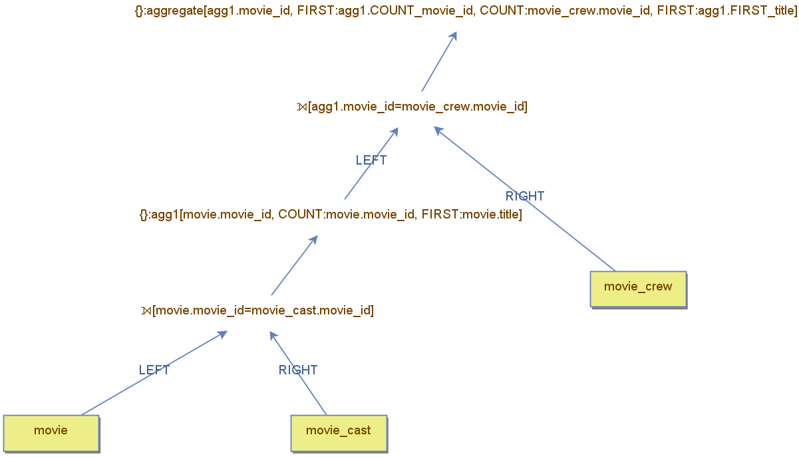

## Optimization Techniques

When planning a query, two key factors should be considered:  
1. **Reducing memory consumption**  
2. **Minimizing I/O transfers from disk to memory**  

Transferring pages from disk is an expensive operation, especially when using **magnetic disks**. This is because locating data involves **mechanical movement**—spinning platters and repositioning the read head.  
Even with **SSDs**, where access time is significantly lower, avoiding disk I/O is still beneficial. Keeping data in **main memory** prevents unnecessary **system calls**, which trigger internal OS operations and add overhead.  

On the other hand, excessive memory usage can lead to **wasting available RAM**, forcing the OS to **swap** data to disk. This creates a **vicious cycle**, as swapping brings back the **I/O bottleneck**—moving data **to and from disk**.  

Some query optimization techniques **prioritize reducing memory consumption**, while others focus on **minimizing disk I/O**. When designing a query plan, it's crucial to determine **Which factor is more important** for the specific query.  
and **Whether a balanced approach** between both criteria is necessary.  

### Fundamental Query Optimization Techniques  
Database literature highlights three basic techniques for optimization:  
- **Pushing down filters** – Apply filtering as early as possible to reduce the amount of data processed.  
- **Combining join operations** – Optimize join execution order to reduce intermediate result size.  
- **Removing unnecessary columns early** – Select only relevant columns at the start to minimize memory usage.  

While many other strategies exist, these three provide a solid foundation for understanding **how to optimize query execution** effectively.  


## Combining Join Operators

When defining a **join operator**, it is crucial to decide which component (**table/subquery subtree**) should be on the **outer** or **inner** side. This decision depends on the **join algorithm** used and the **optimization criteria** prioritized.  

### Optimizing Nested Loop Joins 
For a **nested loop join**, reducing the **outer side** minimizes the number of lookups needed on the **inner side**. Consider the two query trees below, which join `movie` and `movie_cast`:  

  

- **Left tree:** `movie` is the **outer** table.  
- **Right tree:** `movie` is the **inner** table.  

Since `movie` is the **smaller** table, the **left tree** is preferable as it reduces the number of lookups on `movie_cast`.  

However, **table size is not the only factor**—the **inner table must support efficient lookups** for the join to be optimal. This is often **more important** than table size alone.  

Consider a **join between `person` and `movie_cast`**:  

*(Image goes here)*  

- **Size-based decision:** `person` is smaller, so it should be **outer**.  
- **Index-based decision:** `movie_cast` does **not** have an efficient index on `person_id`. It is indexed by **(movie_id, person_id)**, making lookups by `person_id` inefficient.  

Because `person_id` is **not a leading index column**, it cannot be queried efficiently. **In this case, `movie_cast` should be the outer table**, as `person` allows efficient lookups using its primary key.  

If we need to keep `movie` as the **outer** table, we can **create an index on the foreign key `movie_cast.person_id`**. This index enables efficient lookups and improves join performance:  

*(Image goes here)*  

- **New index:** `fk_mca_person` on `movie_cast.person_id`.  
- **Lookup process:**  
  - The index retrieves the **primary key** of `movie_cast` (`movie_id`, `person_id`).  
  - A secondary lookup efficiently fetches the corresponding row.  

This example highlights the **importance of indexing foreign keys** to enable **efficient join execution** and **query optimization**.  


## Optimizing Hash Joins  

For a **hash join**, reducing the **inner side** minimizes the amount of memory needed to build the hash table. Consider the two query trees below, which join `movie` and `movie_cast`:  

*(Image goes here)*  

- **Left tree:** `movie` is the **outer** table.  
- **Right tree:** `movie` is the **inner** table.  

Since `movie` is the **smaller** table, the **right tree** is preferable because it reduces memory consumption when constructing the hash table.  

The example above could also be efficiently solved using a **nested loop join** by leveraging an **index** instead of a hash table. The **nested loop join** would reduce memory usage, while the **hash join** offers slightly faster lookups due to its **O(1) search cost**. This demonstrates how choosing a **join algorithm** influences the **table placement** in the query plan.  

### When Hash Join is the Best Choice  
In some cases, a **hash join is the only efficient option**, specifically, when **no indexes are available** on the join condition.  

For example, consider a query that finds movies whose **title matches a character name** in any movie:  

```sql
SELECT m1.title, mc.character_name
FROM movie m1
JOIN movie_cast mc ON m1.title = mc.character_name;
```

If there are **no indexes** on `title` or `character_name`, **other join algorithms become inefficient**. The **hash join** is the best choice in this scenario, as it avoids expensive sequential scans and reduces the number of comparisons.

## Pushing Down Filters  

The concept behind this strategy is straightforward: **applying filters as early as possible reduces the amount of work needed for the rest of the query execution**.  

### Pushing it down

Consider a query that retrieves **character names and cast orders**, but only for **cast orders greater than 100**, and ensuring that the result **does not contain duplicates**.  

*(Image goes here)*  

- **Left Query:** The **duplicate removal** is applied **before** the filter.  
- **Right Query:** The **duplicate removal** is applied **after** the filter.  

The **duplicate removal** is a **materialized operation**, meaning it stores all tuples in order to perform its computation.  The **Left Query** materializes **all tuples**, including those that will be **filtered out later**.  On the other hand, the **Right Query:** **filters first**, ensuring that **only relevant tuples** are materialized, **reducing unnecessary computation**.  Since **fewer tuples need to be processed**, the **right query** is the **more efficient** approach.  


### Ordering Filters for Efficiency  

When multiple filters are applied to a table, **it is generally better to process the most selective filter first**.  

The example above filters `movie_cast` by `cast_order` and `character_name`. The **First Query**  filters  by `cast_order` first, while the **Second Query** filters by `character_name` first.  

*(Image goes here)*  


Since the **filter on `character_name` is more selective**, the **second query is more efficient** because it reduces the number of tuples before applying the next filter.  

However, in this particular case, the difference between these two plans is minimal. Both queries **scan the entire `movie_cast` table**, and the only difference is **the number of tuples reaching the second filter**.  

The **third query** in the example **applies both filters in a single operation**, reducing the number of **pipeline steps** while still scanning `movie_cast`. This approach is generally more efficient.

---

### Indexed Filters: A Game Changer  

The situation changes if **one of the filtered columns is indexed**. If the indexed filter is **selective enough**, applying it **first** is beneficial—even if another filter is **more selective**—because the index **avoids scanning the entire table**.

The example above uses an index on `cast_order` . The **filter on `cast_order` is applied first** using an **index lookup** instead of scanning `movie_cast`. Then, a **nested loop join** retrieves the required `movie_cast` columns (including `character_name`).  The **filter on `character_name` is applied afterward**.  

*(Image goes here)*  


This approach **only works if the indexed filter is highly selective**. Otherwise, the overhead of joining `movie_cast` would outweigh the benefits, making a **full table scan with direct filtering more efficient**.


When **both filtered columns have indexes**, and the filters are **selective enough**, an efficient strategy is to **intersect the index pointers** before accessing the table.  

IN the exmple below, **Each index processes its respective filter independently:**   
   - One index handles the **`cast_order` filter**.  
   - Another index handles the **`character_name` filter**.

**An intersection operator** keeps only the index entries that **satisfy both filters**.  Finally, a **join with `movie_cast`** retrieves the full row content.  
   - 
*(Image goes here)*  


This approach significantly **reduces the number of rows accessed in `movie_cast`**, improving performance by avoiding a full table scan.  


### Example based on the Nested Loop Join  

Consider the queries below, which retrieve **only `movie_cast` entries from the year 2010 where `cast_order` is greater than 200**. These are **highly selective** filters—few movies were released in 2010, and even fewer have more than 200 cast members.  

*(Image goes here)*  

Both queries use the **nested loop join** strategy:  

- **Left query:** Filters are applied **after** the join.  
  - This is inefficient because the join processes **many irrelevant rows** that are later discarded.  

- **Right query:** Filters are **pushed down** before the join.  
  - This **eliminates irrelevant rows early**, reducing the number of tuples processed by the join.  

The right query **chooses `movie_cast` as the outer table** because the filter on `cast_order` is more selective than the filter on `year`. This highlights how **the presence of filters can influence join ordering**.  

Notice that in the optimized query, the **join condition disappears** from the join operator and is instead applied as a **filter on `movie`**. This happens because it is the operator **connected** to `movie` that drives the lookup. If the filter on `year` were applied directly to `movie`, it would trigger a **full scan** of `movie`, negating the benefits of filtering early. To prevent this, the **join condition is transformed into a filter on `movie`**, ensuring that only relevant rows are fetched.  As a result, the **join operator itself has an empty condition**, since **the filtering is already handled before the join occurs**.  

### Key Takeaways  
✅ **Apply filters as early as possible** to reduce unnecessary computations.  
✅ **Filters can influence join ordering**, changing which table is placed on the outer side.  
✅ **Join predicates may be rewritten as filters** to optimize query execution.  


### Example based on the Hash Join


When using a **hash join**, placing the most **selective filter** on the **inner side** can significantly **reduce memory consumption**.  

 Consider a query that retrieves **movies from 2010** where the **title matches a character name** from any movie, as long as the **cast order is above 100**.  In this scenario, the most **memory-efficient** solution **places `movie_cast` on the inner side** of the join. This minimizes the size of the **hash table**, reducing memory usage. 

*(Image goes here)*  


A **hash join** is also useful when handling **semi joins** or **anti joins**, especially when applying a **selective filter** to the **secondary part** (the table whose tuples are not exposed in the result).  

A **nested loop join** cannot place the **filtered table** on the outer side when performing a **semi join** or **anti join**. This is because **nested loop joins only support these operations when the primary table (the one whose tuples are returned) is the outer table**.  

To **push the filter to the outer side**, a **hash join-based algorithm** is required, such as **Hash Right Semi Join**  or **Hash Right Anti Join** .

The query below retrieves **movie titles with more than 200 cast members** using a **Hash Right Semi Join**, where the **primary table (`movie`) is placed on the inner side**.  

*(Image goes here)*  

those
Another way to work around the **nested loop join limitation** is to apply a **Duplicate Removal** operator **before the join**, as indicated in the image below.  This solution **Removes duplicate values of `movie_id`**  and **Ensures each movie is looked up only once** in the inner table.


## Removing Unnecessary Columns Early  

Queries often require only a subset of a table's columns. In some cases, **removing unnecessary columns early** can be beneficial, especially in terms of **memory consumption**.  

### Impact on Pipeline Execution  

In **pipeline execution**, keeping extra columns **has little impact**, since operators access the full row directly. The example below joins `movie` and `movie_cast`, returning only `title` and `character_name`.  **All columns remain available until the final projection**. However, they do not affect the join operation.  

*(Image goes here)*  

### Impact on Materialized Operations  

For **materialized operations**, **removing unnecessary columns before materialization** is crucial to **reduce memory usage**.  

Consider the same query, now using **hash join**:  

- The **left tree** keeps all columns throughout execution.  
- The **right tree** applies a **projection before building the hash table**, keeping only:  
  - The **join column**.  
  - The **columns needed for the final output**.  

This approach significantly **reduces memory consumption**, making it the preferred strategy.  

*(Image goes here)*  
## Early Projection in Materialized Operators  

Several **materialized operators** benefit from **early projection**, including:  
- **Sort**  
- **Hash Intersection**  
- **Hash Union**  
- **Hash Difference**  
- **Hash Joins (and their variants)**  

### Example: Sorting Character Names by Cast Order  

Consider the query below, which **retrieves character names from movies released in 2010, sorted by cast order**.  

- The **left tree** does not apply an early projection, meaning **all columns remain available** until the final selection.  
- The **right tree** applies a **projection before the Sort operator**, keeping **only the necessary columns** (`character_name` and `cast_order`).  

By **removing unnecessary columns before sorting**, the **right tree** reduces **memory consumption** and **improves efficiency**.  

*(Image goes here)*  


## Sorting Operators  

Sorting plays a crucial role in query execution plans. It may be required because:  
- The **user explicitly requests sorted data** (e.g., `ORDER BY`).  
- Certain **operators require sorted data** to function efficiently.  


Sorting typically **requires materialization**, meaning data must be fully processed before being sorted. However, materialization **can be avoided** if **pre-sorted data** is available, such as from an **index**.  

Consider a query that retrieves **movie titles and release years, sorted by release year**:  

- **Left Query**: Uses a **Sort operator** to order rows after retrieving them from the `movie` table.  
- **Right Query**: Uses an **index on `release_year`** to retrieve pre-sorted data. Since the index does not store the title, a **join with the `movie` table** is necessary.  

However, using the index **may not be ideal** in this case, as the join requires **too many random lookups**, making it inefficient.  

*(Image goes here)*  

Now, consider a query that retrieves **only movies released before 1930**:  

- In this case, using the **index is beneficial** because it efficiently filters movies by year **while also providing sorted data**.  
- The **join with the `movie` table** is not costly here, since **only a small number of entries** are retrieved from the index.  

*(Image goes here)*  


As stated, some operators **require sorted input** to function efficiently. Examples include:  
- **Merge Join**  
- **Set operations** (`UNION`, `INTERSECT`, `EXCEPT`)  

If data is **already sorted**, these operators tend to be **highly efficient**. However, if sorting is required beforehand, it may be **better to use alternative operators** that do not depend on sorted input.  

Consider the following query plans:  

- **Left Query**: Uses **Merge Join** to join `movie` and `movie_cast`. Since **both tables are already sorted by `movie_id`**, the join is efficient, scanning both sides sequentially as matches are found.  
- **Right Query**: Uses **Merge Join** to join `person` and `movie_cast`. However, `movie_cast` **is not sorted by `person_id`**, requiring an additional **Sort operator**.  

In this case, using **Nested Loop Join** instead may be a better choice, placing `movie_cast` in the **outer side of the join** to avoid the costly sorting step.  

*(Image goes here)*  
## Conclusion: Applying Multiple Optimization Strategies  

To conclude, consider the following **query example**, which incorporates several of the optimization techniques discussed earlier.  

### Query Goal  
Find movies where the **title matches a character name** whose **cast order is 1**.  
(*Note: The movie does not need to be related to the character.*)  

### Query Execution Plan  
The query plan below outlines an efficient strategy:  

1. **Index Scan on `cast_order`**  
   - Uses an **index on `cast_order`** to filter rows where `cast_order = 1`.  

2. **Join with `movie_cast`**  
   - Retrieves additional columns from `movie_cast`.  

3. **Hash-Based Join for Title Matching**  
   - Since **no index exists on `title` or `character_name`**, a **hash join** is used for comparison.  
   - Since only movie columns are needed, a **hash semi-join** is chosen.  
   - As the main input is on the **inner side**, a **hash right semi-join** is applied.  

4. **Early Projection Before the Join**  
   - A **projection operator** ensures that only **relevant movie columns** are sent to the **hash join**, reducing memory usage.  

*(Image goes here)*  

### Final Thoughts  
While this is a **valid optimization strategy**, many other alternatives exist, using different operators.  
- **Changing a single operator** can require **adjusting the entire query plan**.  
- This highlights the complexity of the **query optimizer**, which must carefully consider multiple factors when selecting the most efficient execution plan.  

**DBest** illustrates how different strategies can be applied and **demonstrates the critical role of query optimization** in database performance.  
