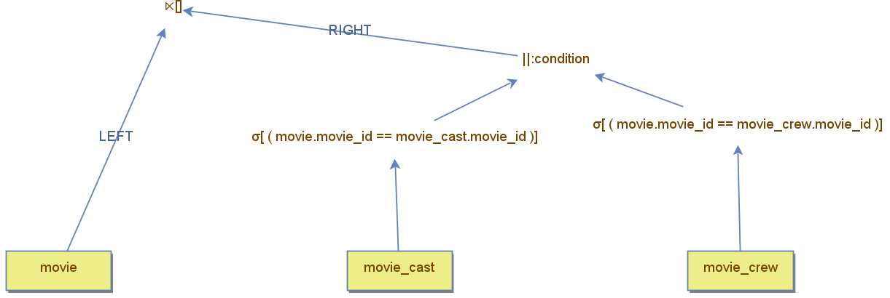

<div align="left">
    <a href="./18.1.4 - subqueries-and-direct-comparison.md">Previous</a>
</div>
<div align="right">
  <a href="./18.2 - Subqueries-in-from-clause.md">Next</a>
</div>

## Boolean Expressions with Subqueries in SQL  

In SQL, some subqueries evaluate to **true** or **false**, such as those used with `IN` and `EXISTS`.  
Other subqueries also return a boolean result when combined with a **comparison operator**,  
such as `> ANY` or `= ALL`.  


Since these subqueries produce boolean values, they can be used as **terms**  in complex logical expressions.  

For example, the following query retrieves movies that have either **cast members** or **production members**:  

```sql
SELECT * FROM movie  
WHERE movie_id IN (SELECT movie_id FROM movie_cast)  
OR movie_id IN (SELECT movie_id FROM movie_crew);  
```

DBest provides a **set of boolean expression operators** that allow subqueries to be combined using logical operators.  

For instance, the query above can be represented in DBest as follows:  



The **OR operator** takes two **subtrees** as input,  where each subtree represents a **subquery**.  The Nested Loop Semi Join makes sure each movie appears only once in the result set. 

Logical operators in DBest are **binary**, meaning more complex conditions require **nesting** multiple logical operators.  For example, when expressing multiple disjoint conditions,  the query structure forms a **binary tree**,  where **internal nodes** are OR operators.  


<div align="left">
    <a href="./18.1.4 - subqueries-and-direct-comparison.md">Previous</a>
</div>
<div align="right">
  <a href="./18.2 - Subqueries-in-from-clause.md">Next</a>
</div>
