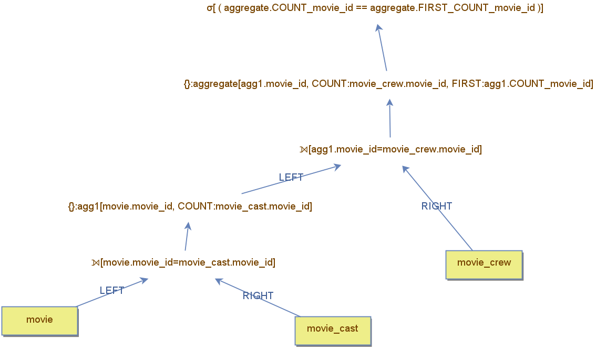
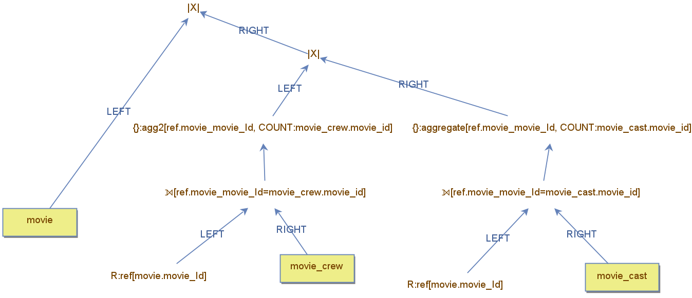

<div align="left">
    <a href="./18.1.5 - subqueries-in-boolean-expressions.md">Previous</a>
</div>
<div align="right">
  <a href="./18.3 - subqueries-in-select-clause.md">Next</a>
</div>


## Subqueries in the `FROM` Clause  

In SQL, a **subquery** can appear inside the **`FROM` clause** of an outer query.  When used this way, the subquery is treated as a **temporary table**.  

This approach is particularly useful for **complex computations**,  such as **aggregations**, where rows are grouped into **meaningful clusters**.  
These grouped results can then be **joined** with other tables   or even with the results of additional subqueries.  


The query below retrieves movies where the **number of cast members**  is **equal** to the **number of crew members**.  

The `FROM` clause consists of two **subqueries** joined together using two conditions based on `movie_id` and row counts.  

```sql
SELECT * FROM  
(SELECT movie_id, count(*) as cont FROM movie_cast GROUP BY movie_id) as agg1  
JOIN  
(SELECT movie_id, count(*) as cont FROM movie_crew GROUP BY movie_id) as agg2  
ON agg1.movie_id = agg2.movie_id AND agg1.cont = agg2.cont;  
```

In **DBest**, the same query can be represented by using two **`GROUP BY`** operators: one for **`movie_cast`**  and one for **`movie_crew`**  
These operators **generate new schemas**, which must be **renamed** (`agg1` and `agg2`) to ensure unique schema names.  SQL also requires the naming of temporary tables, as indicated above.  


  

The **Nested Loop Join** operator matches tuples from `agg1` and `agg2`,  using **two lookup conditions**:  
  - **Matching `movie_id`**  
  - **Matching row count**
   
The **inner side** of the join is **materialized**,  so that the **grouping computation** occurs **only once**.  


When we say that subqueries in the `FROM` clause are treated as temporary tables,   it does not necessarily mean that these tables are **materialized**.  In the provided example, **only the inner table is materialized**.   The outer table takes advantage of the fact that **`movie_cast` rows are ordered by `movie_id`**,   allowing the **`GROUP BY`** operator to be executed in a **pipelined fashion**. 

# Handling Movies Without Cast or Crew Members  

One issue with the previous example is that movies without cast or crew members are ignored. This happens because the query never directly references the `movie` table.  

Another related drawback is that no columns from the `movie` table are available in the result.  

To solve this, we explicitly include the `movie` table in the query. The idea is to use it as a **pivot**, ensuring that both temporary tables reference the movie currently being processed.  

However, these temporary tables exist at the same level as `movie` in the `FROM` clause.  

To make them dependent on `movie`, we use the **`LATERAL`** clause, as shown in the query below:  

```sql
SELECT title
FROM movie m1
JOIN LATERAL (
    SELECT COUNT(*) AS cont FROM movie_cast mc
    WHERE mc.movie_id = m1.movie_id
) AS agg1 
JOIN LATERAL (
    SELECT COUNT(*) AS cont FROM movie_crew mc
    WHERE mc.movie_id = m1.movie_id
) AS agg2 
ON agg1.cont = agg2.cont;
```

This query requires only the `title` column. Notice that the subqueries contain a **correlated column** (`m1.movie_id`) referring to the `movie` table.  
This is only possible because of the `LATERAL` clause.  


In **DBest**, this query is represented by a **tree structure**, where processing starts at the `movie` table.  

### Step-by-step execution:  


## Query Execution Steps  

1. A **nested loop left outer join** is performed with the `movie_cast` table.  
   - The **outer join** ensures that movies without cast members are included.  

2. A **`GROUP BY`** operation (names `agg1`) is applied.  

3. This `GROUP BY` operation retains three columns:  
   - **`movie_id`** → The grouping column.  
   - **`title`** → Computed using the `FIRST` aggregation function.  
     - This function takes the first occurrence of the title within the group, but any occurrence would work.  
   - **`cast_count`** → Computed using the `COUNT` aggregation function.  

4. The same process is repeated for the `movie_crew` table:  
   - Another **outer join** is followed by a **`GROUP BY`** operation to compute the crew member count.  

5. The second `GROUP BY` operation(named `agg2`) retains four columns:  
   - **`movie_id`** → The grouping column.  
   - **`title`** → Retrieved from the previous aggregation using the `FIRST` function. 
   - **`cast_count`** → Retrieved from the previous aggregation using the `FIRST` function.  
   - **`crew_count`** → Computed using the `COUNT` aggregation function.  

6. A **filter operator** is applied to ensure that the **cast and crew counts are equal**.
7. Finally, a **projection operator** maintains only the `title` column.   


  


## Using the Reference Operator  

An alternative way to achieve a similar outcome is by using the **Reference operator**.  

The Reference operator retrieves columns from operations that have already been processed. In this case, it retrieves `movie_id` from the `movie` table.  

For each movie, two separate subtrees are executed, each relying on a Reference operator:  

- One subtree calculates the **number of cast members per movie**.  
- The other subtree calculates the **number of crew members per movie**.  

Finally, these subtrees are **joined** with the `movie` table. To refine the result, a **projection operator** can be applied, preserving only the `title` column.  

This approach offers an additional advantage: since all columns from the pivot `movie` table remain accessible, there is no need to retain them throughout the **GROUP BY** execution using the specialized **FIRST** aggregate function, as required in the previous method.  

  

In summary, the key benefit of this method is that it explicitly incorporates the `movie` table, ensuring its columns are accessible in the result.  

However, this is just **one possible approach**. Other alternatives include performing a final join with the `movie` table.  

We demonstrated this version using the **Reference operator** to highlight the flexibility of different query structures and execution strategies.  


<div align="left">
    <a href="./18.1.5 - subqueries-in-boolean-expressions.md">Previous</a>
</div>
<div align="right">
  <a href="./18.3 - subqueries-in-select-clause.md">Next</a>
</div>
