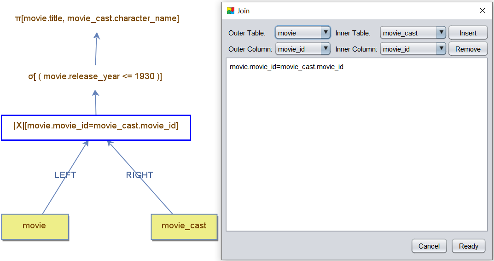
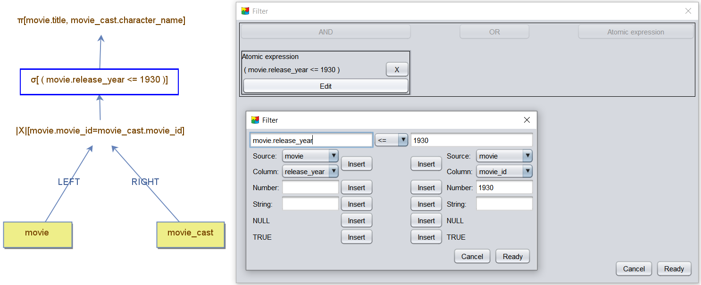
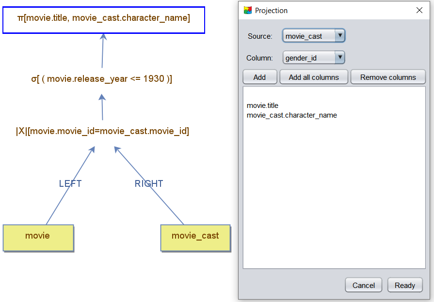

# Creating a Query Tree in DBest

In DBest, a **query tree** consists of two types of nodes:  
- **Data Nodes**: Represent data sources and are located in the **left panel**.  
- **Operator Nodes**: Represent transformations or operations and are located in the **right panel**.

A query tree is constructed by adding nodes to the editor, connecting them, and configuring their properties.

## Adding Nodes to the Editor

1. **Adding Operator Nodes**:
   - Click on the desired operator in the **right panel**.
   - Move your mouse to the editor and click to place the operator.

2. **Adding Data Nodes**:
   - Drag and drop a data node from the **left panel** into the editor.

## Connecting Nodes

1. Click the **"Edge"** button in the **bottom menu**.  
2. Select the **source node** by clicking on it.  
3. Select the **target node** to complete the connection.

## Editing Node Properties

Once nodes are connected, a **property window** will open for the operator. Alternatively, you can open the properties window by **right-clicking** the operator node and selecting **"Edit"**.

For **binary operators**, the property window appears only after both child nodes are connected. Properties can only be edited if the node is valid and accepts them.

### Operator Properties

The properties required for configuration depend on the type of operator. Examples include:  
- **Projection Operator**: Prompts you to select columns to project, based on the schema of its child node.  
- **Join Operator**: Requires a join predicate and displays columns from the left and right child nodes.  
- **Filter Operator**: Defines a boolean expression that must be satisfied, based on columns from its child node.

# Example: Configuring a Query Tree

The following example demonstrates configuring a query tree with join, filter, and projection operators.

1. **Join Operator**:  
   The property window for the join operator shows the available columns from the left (`movie`) and right (`movie_cast`) child nodes. The join predicate is defined as:  
   `movie.movie_id = movie_cast.movie_id`.

   

2. **Filter Operator**:  
   The property window for the filter operator defines an atomic expression comparing the `cast_order` column to a constant value.  

   

3. **Projection Operator**:  
   The property window for the projection operator specifies two columns for retrieval:  
   - `title` from the `movie` data node.  
   - `character_name` from the `movie_cast` data node.

   

