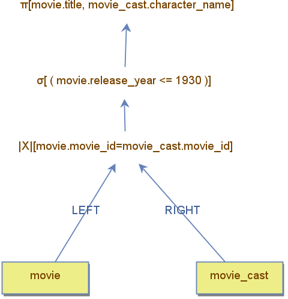

## Getting Started with DBest Operators

The **DBest** tool provides a wide range of operators that allow users to create complex queries. To get started, focus on the foundational operators of relational algebra, such as:  
- **Projection**  
- **Selection (Filter)**  
- **Join**  
- **Aggregation**  

---

### Example: Configuring a Query Tree

The example showcases a query tree that combine basic operators:  
- **Join:** Combines `movie` and `movie_cast` tables.  
- **Filter (Selection):** Filters rows based on the `year`.  
- **Projection:** Projects only the `title` and `character_name` columns.  

The following screenshots demonstrate how to configure the query tree operators:

1. **Join Operator**:  
   The property window displays the available columns from the left (`movie`) and right (`movie_cast`) child nodes. The join predicate is defined as:  
   `movie.movie_id = movie_cast.movie_id`.

   

2. **Filter Operator**:  
   The property window for the filter operator defines an atomic expression that compares the `cast_order` column to a constant value.

   

3. **Projection Operator**:  
   The property window for the projection operator specifies two columns for retrieval:  
   - `title` from the `movie` data node.  
   - `character_name` from the `movie_cast` data node.

   

---

## Running Queries

Once a query is built, you can execute it in the following ways:  
1. **Double-click** any node in the query tree.  
2. **Right-click** a selected node and choose the **"Run Query"** option from the menu.

### Querying Any Node
- **Internal Node**: Running a query on an internal node returns the intermediate result set generated up to that point in the query tree.  
- **Root Node**: To obtain the final result set, execute the query on the root node.

### Example: Root Node Execution
In the example below, the result set is generated by double-clicking the root projection node.  

### Navigating the Result Set
- Use the **arrow buttons** to navigate through the result set:
  - **Forward**: Computes and retrieves new tuples.  
  - **Backward**: Retrieves previously stored tuples from an earlier forward navigation.

### Exploring Operator Variations

The example above demonstrated basic operators. However, many operators have variations that differ in semantics and efficiency. For instance, the **join** operation includes:  
- **Join Types:** `cross-join`, `inner-join`, `semi-join`, `anti-join`, and `outer-join`.  
- **Join Algorithms:** `nested-loop`, `merge-join`, and `hash-join`.  

Start with the classic operators to build a solid foundation. Once comfortable with the basics, experiment with these variations to better understand their use cases and performance implications.

---

### Tips for Beginners

1. **Start Small:** Use small data sources initially to prevent inefficiencies that may cause the tool to hang.  
2. **Experiment:** Rearrange operators and observe how they affect the result set and query performance.  
3. **Learn by Doing:** Focus on understanding the purpose and behavior of each basic operator before experimenting with advanced operators or indexing strategies.
