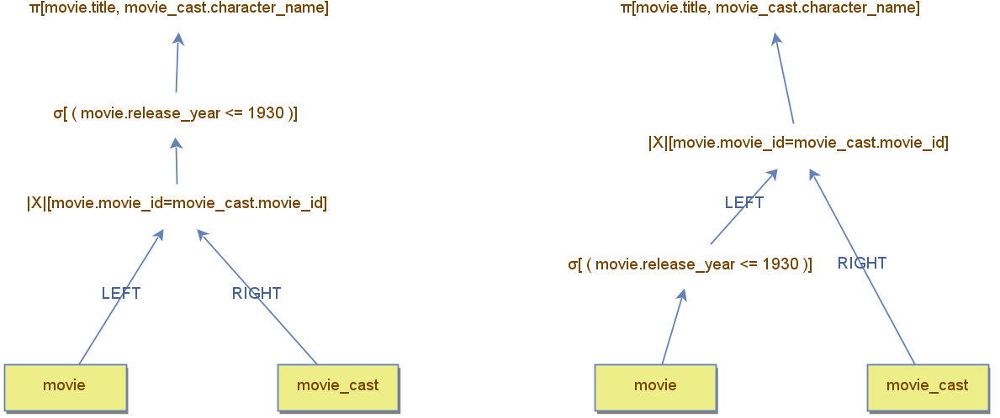

## Getting Started with DBest Operators

The **DBest** tool includes a wide range of operators that enable the creation of complex queries. To begin, it’s recommended to start with the basic operators, which are foundational to relational algebra:  
- **Projection**  
- **Selection**  
- **Join**  
- **Aggregation**  

Some operators, like **joins**, have multiple variations, as join types (cross-join, inner-join, semi-join, anti-join, outer-join) and join algorithm (nested-loop, merge-join, hash-join). As a starting point, use the classic **Inner Join**. One you become familiar with how  the basic operators work, you can try different ones. 

The example below illustrates two query trees that combine basic operators:
- **Join:** Combines `movie` and `movie_cast`.
- **Filter (Selection):** Filters rows based on the `year`.
- **Projection:** Projects only the `title` and `character_name` columns.
  

#### Key Difference:
- The **left tree** applies the filter operator after the join.  
- The **right tree** applies the filter operator before the join.

The position of the operators can significantly affect query performance. In the example provided, it is better to perform the filter before the join, as it reduces the effort spent on finding matches. 

---

### Tips for Beginners
1. **Start Small:** Use small data sources to avoid the tool hanging due to inefficient operator choices.
2. **Experiment:** Change the position of operators and observe how they impact the result set and query execution time.
3. **Learn by Doing:** Focus on understanding the purpose and behavior of each basic operator before moving on to advanced operators or creating indexes.

