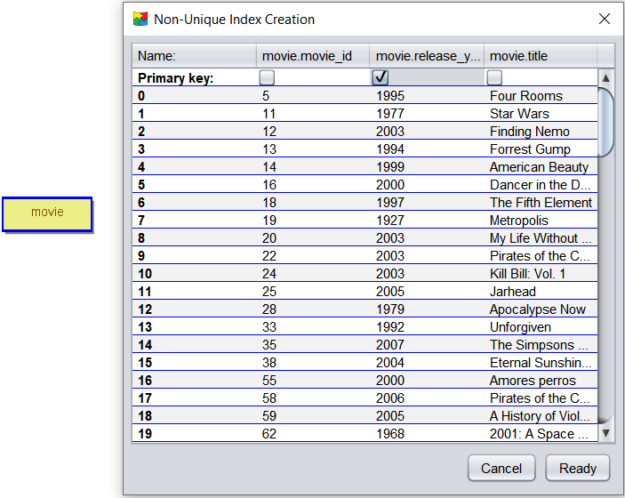
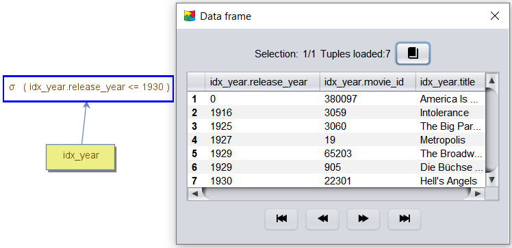
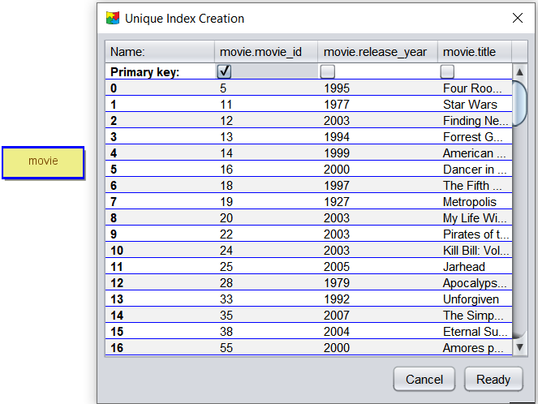
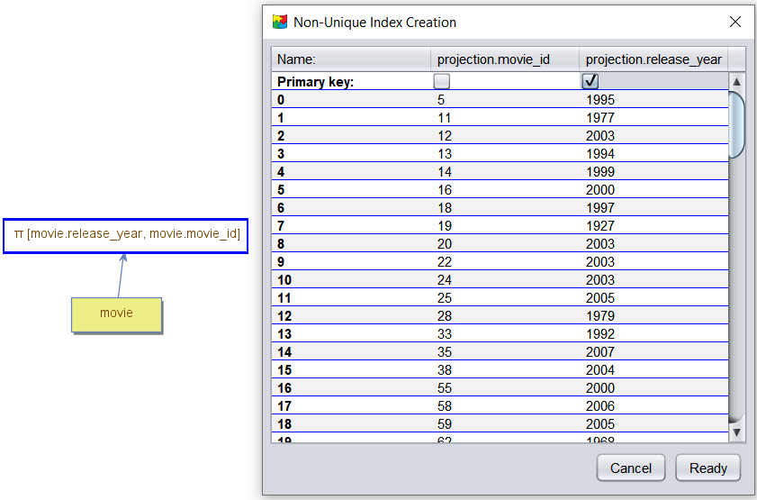
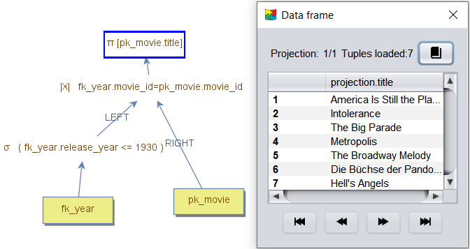

# Working with Indexes in DBest

In DBest, **data nodes** can be indexed or non-indexed. Non-indexed data nodes, such as memory tables or CSV files, provide **sequential access** to their tuples. When performing a lookup, all tuples must be traversed to find matching results. To improve performance, DBest supports indexed data nodes in the form of **B+ trees**, enabling **efficient lookups** and **ordered access** over key columns.

## Overview of B+ Tree Indexes

A B+ tree index:
- Stores **key/value pairs**.
- Supports **efficient lookups** using the key columns.
- Provides **ordered access** to the key columns.

An index can be:
- **Unique**, ensuring no duplicate values in the key part.
- **Non-unique**, allowing duplicate values for the key part (useful for columns with repeated values).

### How B+ Tree Indexes Work
The nodes of a B+ tree are stored on disk in a persistent data format called a **page**. Pages are designed to minimize the effort of loading data from disk into memory by aligning with the size of typical virtual memory pages (e.g., 4 KB). 

Since each node in a B+ tree can store a large number of children, the tree's height is reduced. This high degree ensures that searches require loading only a few pages, optimizing performance.

---
## Creating and Using an Index

### Steps to Create an Index:

1. **Right-click** on the node whose tuples you want to index.
2. Select the **"Export Table"** menu item and chose **"Unique Index"** or **"Non-Unique Index"**.
3. A configuration window appears, displaying:
   - All columns returned by the node.
   - Sample tuples for reference.
4. Select the key column(s) using radio buttons
5. **Specify the index name** and its **location on disk**.
   - The index will be saved with a `.dat` extension.

When selecting multiple columns for the key, their order in the index is determined by the order in which the radio buttons are checked. This is called a **composite index**. Efficient lookups are possible only if the filter includes the **prefix of the key**. For a composite index with `n` key columns, the first `n-1` keys must have equality conditions.

When creating composite indexes:
  - Prioritize frequently filtered columns in the prefix.
  - Use equality conditions for all but the last key column.

---

### Using the Index:
1. **Load the index**:
   - Use the appropriate menu item in the **top menu**, or
   - Drag and drop the index file into the query editor.
2. The node will appear in the left panel.
3. **Query the index**:
   - Drag the indexed node into the query editor.
   - Double-click the node to view tuples ordered by the key column(s).
---

### Example: Creating and Using an Index over Year 

The image below illustrates the creation of a **non-unique index** for the `year` column in the `movies` data node. The node contains the columns `movie_id`, `title`, and `year`. Only the `year` column is selected as the key, while the remaining columns become the value part.

If a **unique index** were created instead, any records with duplicate `year` values would be excluded.

After saving the index (e.g., `idx_year.dat`):
- Load the index into the tool.
- Drag it into the query editor for filtering or querying.

The image below shows a query tree where a filter on the `year` column is connected to the index node.

The filter uses the B+ tree to perform efficient key searches. For selective queries, the number of disk page accesses is significantly lower compared to sequential access. To analyze this, run the query and view the **Cost panel**, which displays the number of disk pages loaded.

---

## Clustered and Non-clustered Indexes

Indexes in DBest can be **clustered** or **non-clustered**, differing in how the value part is structured:
- A **clustered index** stores the entire tuple as the value part, effectively replacing the original data node.
- A **non-clustered index** stores pointers to the tuple location, requiring access to the original data node for complete information.

### Primary Index (Clustered)
A clustered index is typically built on the **primary key** column(s), which uniquely identify tuples. For this reason, it is also referred to as the **primary index**. A data node usually have only one clustered index.

### Secondary Index (Non-Clustered)
Non-clustered indexes, or **secondary indexes**, are built on columns other than the primary key. During querying, the secondary index is typically joined with the primary index to retrieve full tuple information.

---

## Example: Creating a Clustered Primary Index and a Non-Clustered Secondary Index

### Creating a Clustered Primary Index:
1. Load the `movies` data node into the query editor.
2. Use the **Unique Index** option.
3. Select `movie_id` as the key column.

The image below shows the configuration window for defining the key/value parts of the index.

The `movie_id` column becomes the key, while the remaining columns are stored in the value part. This index (`pk_movie`) allows querying the `movies` data, sorted by `movie_id`.

---

### Creating a Non-Clustered Secondary Index:
1. Load the `movies` data node into the query editor.
2. Build a query tree to project the `year` and `movie_id` columns.
3. Export the projection node as an index using the **"Non-Unique Index"** option.
4. Select `year` as the key column.

The image below shows the configuration window for defining the key/value parts of the secondary index.

The `year` column becomes the key, and `movie_id` becomes the value. Running a query on this index displays only these two columns, ordered by `year`. To access other columns (e.g., `title`), **join the secondary index** with the primary index using `movie_id` as the join predicate.

The image below shows an example query tree where:
- The filter on `year` efficiently retrieves movies from the secondary index.
- The join operator accesses additional information from the primary index.

To avoid joins, you can create a **clustered secondary index**, where all tuple information is stored in the value part. This eliminates the need for a primary index join but duplicates the data node content, increasing memory usage. Carefully decide based on redundancy, query performance, and update costs.

An alternative is to include only the most important columns in the value part of a secondary index. This reduces redundancy and update costs while improving query performance for those specific columns. Indexes that store all columns required for a query in the key/value part are called **Covering indexes**.

