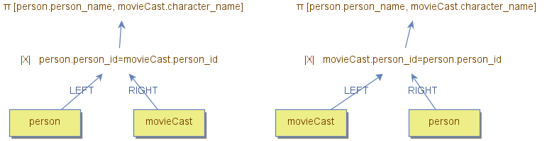
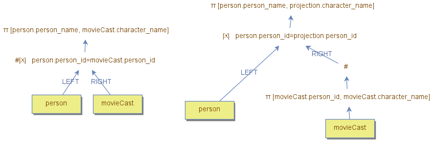
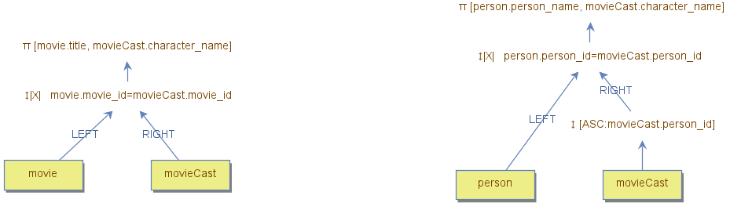

# Join Algorithms 

## 1. **Nested Loop Join**
The **Nested Loop Join** algorithm processes each tuple from the outer side by searching for matching tuples on the inner side.

### **Key Points:**
- **Naive Strategy:** Scans all tuples on the inner side for each outer-side tuple, which is highly inefficient.
- **Optimized Usage:**  
  - Use an operator on the inner side to improve lookup performance.  
  - Examples include:
    - A data node indexed by the lookup column.
    - A materialized operation that uses the lookup column as the search key.

### **Example:**
In the example below, the outer side is the `movie_cast` data node, and the inner side is the `person` data node indexed by `person_id`. This setup is efficient because the index on `person_id` allows quick lookups for each `movie_cast` tuple.

If the sides are switched, making `movie_cast` the inner side, inefficiencies arise:
- The `movie_cast` node is indexed by both `movie_id` and `person_id`, with `person_id` being the secondary key.
- As a result, the index would need to scan all tuples to locate matches for each outer-side tuple, leading to significant overhead.

### **Solutions for Inefficiency:**
1. **Switch the Sides:** Use the `person` data node as the inner side to leverage its index.
2. **Add a Materialized Operation:** Create a materialized view or structure that reorders `movie_cast` for efficient lookups.
3. **Use a Hash Join:** Replace the Nested Loop Join with a Hash Join for better performance.

---

## 2. **Hash Join**
The **Hash Join** algorithm builds a hash table from the inner side of the join, using the join column(s) as the key. The outer side tuples are then processed by querying the hash table for matches.

### **Key Points:**
- **Efficiency:** Faster than the Nested Loop Join, especially for large datasets.
- **Memory Usage:** Requires memory to store the hash table.
- **Equivalent Process:** 
  - Combines a **Nested Loop Join** with a **Hash operator** and a **Projection operator**.
  
### **Example:**
In the illustration below, the hash join builds a hash table from the inner side and matches tuples from the outer side using the hash keys. This avoids the repeated scanning of the inner side seen in a naive Nested Loop Join.

---

## 3. **Merge Join**
The **Merge Join** algorithm works by scanning both sides of the join in a single, forward-only pass. Matches are identified as tuples are read.

### **Key Points:**
- **Prerequisite:** Both sides must be sorted by the join column(s).
  - A **Sort operator** can be added to enforce the required order.
- **Pitfalls:** If tuples are not ordered properly, some matches may be missed.
- **Efficiency:**
  - When tuples are pre-sorted:
    - This is the **most efficient join algorithm**.
    - Consumes no additional memory.
    - Processes each side only once.

### **Example:**
The image below shows a query tree where the inner side required a **Sort operator** to ensure the tuples were sorted by the join column (`person_id`). When a sort is necessary, it might be better to use an alternative join algorithm due to the overhead introduced by sorting.

---

By understanding these join algorithms, their strengths, and the trade-offs involved, you can make informed decisions to optimize the performance of relational table queries.
