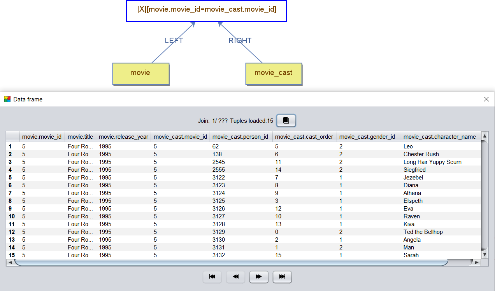
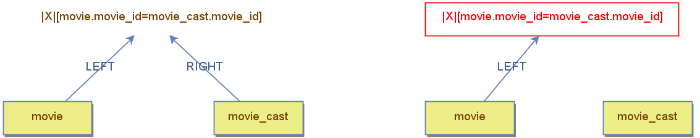

## Operator Schemas in DBest

In DBest, every operator can have **multiple schemas**, as operations combine schemas from the underlying parts of the query tree. These schemas collectively define the structure of the operator’s output data. The schemas are derived from the connected nodes and are influenced by the type of operation performed.

---

### Schema Construction Examples

1. **Projection Operator**  
   - The operator retains a **subset of the schemas** from its child node.  
   - The output includes only the columns specified in the projection's properties.

2. **Join Operator**  
   - The operator combines the schemas from its left and right child nodes, forming a **union** of their structures.  
   - The resulting schemas include all columns from both child nodes.

You can view an operator’s schemas by **running a query** over the node to see the result set. Each column in the result set is prefixed with its corresponding schema name.

The example below displays the result set obtained by joining the `movie` and `movie_cast` data nodes, with column names prefixed by their respective schema names.
 

---

### Dynamic Schema Updates

When editing an operator's properties, the **property window** displays the schemas of the connected nodes. This allows users to configure how the operator processes data streams from its inputs.

If a **child node is disconnected** or replaced by a node with a different schema, the operator dynamically recalculates its schemas.  
If the new schemas are **incompatible** with the operator’s current configuration, the operator’s label turns **red**, indicating invalid properties.  
Users must update the operator’s configuration to resolve the issue.

The example below shows two query trees. The tree on the left is valid. The tree on the right is invalid because the right child node of the join was disconnected. As a result, the join operator becomes invalid since its predicate references a schema no longer part of the tree. The operator is highlighted in red to indicate the problem.

---

### Defining Schema Names

#### Naming and Managing Schemas:
- Schema names are **derived from the names of the connected data nodes**.  
- Certain operators, referred to as **schema-full operators**, consolidate all schemas from their connected nodes into a **single schema** with a default name. An example includes the **Aggregation Operator:**, whose default name is `agg`.  
 
Users can rename schemas by **right-clicking a node** and selecting **Rename**.  Renaming is essential in cases where duplicate schema names might occur, such as:
  - **Self-relationships:** When the same data node is used multiple times in a query.
  - **Multiple schema-full operators:** For example, two aggregation operators joined in a query.

Proper naming ensures clarity and prevents conflicts in complex query plans. This is especially important for queries that rely on precise schema identification to produce correct results.

## Summary
- Operators derive their schema from their connected nodes, adapting dynamically based on the operation they perform.
- The property window shows schema-related details to assist in configuring the operation.
- Invalid properties are flagged to maintain the integrity of the query tree.

